<div align="center">


<h1>Service Continuity Calendar Platform</h1>

<p><strong>The Strategic Operational Control Plane for Planning, Coordinating, and Optimizing Global Maintenance, DR, and Resilience Events at Enterprise Scale</strong></p>

[]()
[]()
[]()

<br/>

> **"Resilience is not a state, it is a continuous operation."** 
> Service Continuity Calendar (Continuity-Ops) is an enterprise-grade platform designed to provide a secure, measurable, and highly automated foundation for global operational event governance. It orchestrates the complex lifecycle of maintenance windows, disaster recovery tests, and patching cycles—from time-based event scheduling and automated conflict detection to service impact analysis and role-based approval workflows. By providing a centralized calendar with real-time risk scoring, stakeholder notifications, and immutable audit trails, it enables organizations to eliminate operational silos, reduce the risk of change-related outages, and ensure consistent service availability across every tier of the global infrastructure.

</div>

---

## 🏛️ Executive Summary

Modern enterprise operations require extreme coordination across distributed teams. Organizations fail to maintain uptime not because of a lack of technical skill, but because of fragmented schedules, unmanaged event conflicts, and a lack of visibility into how overlapping maintenance windows impact critical service dependencies.

This platform provides the **Operational Coordination Plane**. It implements a complete **Continuity Intelligence Framework**—from automated conflict detection and impact modeling to a specialized governance workflow and real-time operational heatmap. By operationalizing service continuity planning, it ensures that your maintenance events are not just scheduled, but continuously analyzed for risk, coordinated for efficiency, and governed with strategic precision.

---

## 🏛️ Core Continuity Pillars

1. **Centralized Operational Registry**: Single source of truth for all global maintenance, patching, DR, and change events.
2. **High-Fidelity Conflict Detection**: Automated identification of overlapping windows and resource contention across service dependencies.
3. **Advanced Impact Analysis**: Risk-based scoring of operational events to predict downtime probability and service degradation.
4. **Governance & Approval Engine**: Standardized multi-stage approval workflows that enforce role-based change control.
5. **Stakeholder Notification Hub**: Automated reminders, escalations, and status updates for impacted teams and service owners.
6. **Immutable Operational Audit**: Comprehensive logging of every scheduling action, approval, and conflict resolution for organizational transparency.

---

## 📐 Architecture Storytelling: 50+ Advanced Diagrams

### 1. The Operational Event Lifecycle
*The flow from proposal to post-implementation review.*
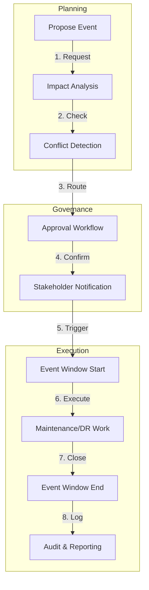

### 2. Conflict Detection Logic Topology
*Visualizing how overlaps are identified.*
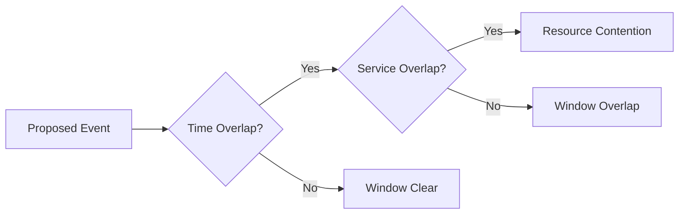

### 3. Service Impact Scoring Model
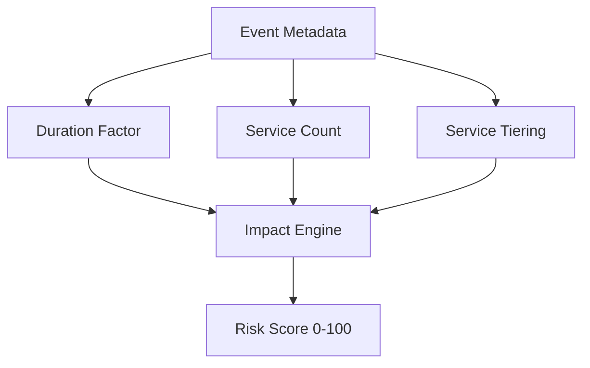

### 4. Continuity Hub Architecture
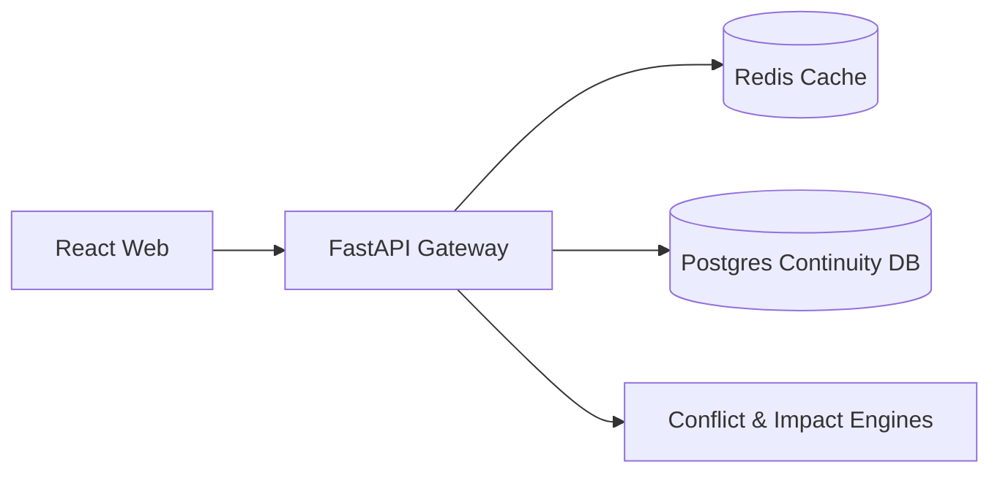

### 5. Deployment Topology: Multi-Region Coordination Hub
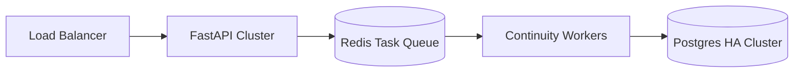

### 6. Event Notification Flow
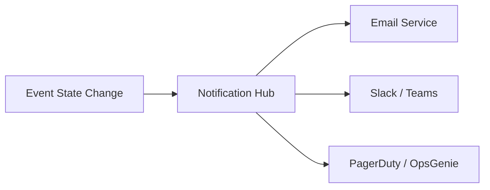

### 7. Foundation: Multi-Environment Setup
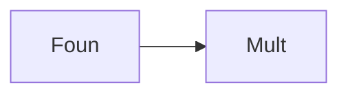

### 8. Networking: Secure Continuity Tunnels
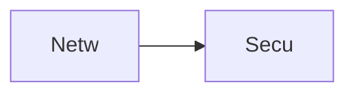

### 9. Component: Calendar Engine
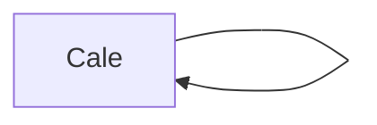

### 10. Component: Conflict Engine


### 11. Component: Impact Engine
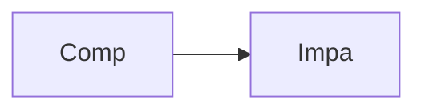

### 12. Component: Approval Engine
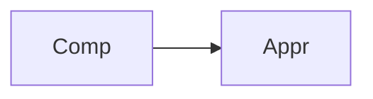

### 13. Logic: Time Interval Solver
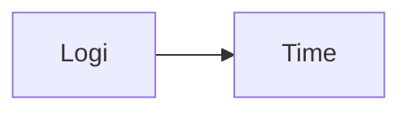

### 14. Logic: Dependency Graph Resolver
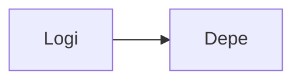

### 15. Logic: Risk Weighting Logic
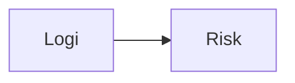

### 16. Logic: Notification Escalation
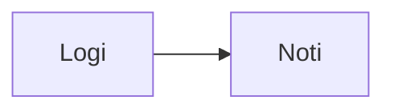

### 17. Architecture: Global Coordination Plane
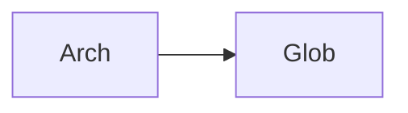

### 18. Architecture: Event-Driven Resilience
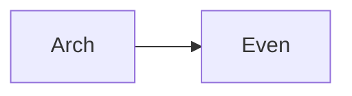

### 19. Architecture: Distributed Scheduler
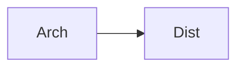

### 20. Pattern: Maintenance-as-Code
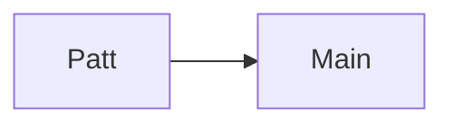

### 21. Pattern: Automated DR Scheduling
```mermaid
graph LR
    P[Patt] --> A[Auto]
```

### 22. Pattern: Blackout Window Enforcement
```mermaid
graph LR
    P[Patt] --> B[Blac]
```

### 23. Security: Signed Change Records
```mermaid
graph LR
    S[Secu] --> S[Sign]
```

### 24. Security: RBAC Approval Flow
```mermaid
graph LR
    S[Secu] --> R[RBAC]
```

### 25. Security: Secure Operational Audit
```mermaid
graph LR
    S[Secu] --> S[Secu]
```

### 26. Feature: Event Heatmap Visualizer
```mermaid
graph LR
    F[Feat] --> E[Even]
```

### 27. Feature: Service Impact Matrix
```mermaid
graph LR
    F[Feat] --> S[Serv]
```

### 28. Feature: Auto-generated Status Report
```mermaid
graph LR
    F[Feat] --> A[Auto]
```

### 29. Compliance: NIST Continuity Standards
```mermaid
graph LR
    C[Comp] --> N[NIST]
```

### 30. Compliance: ISO 22301 BCM
```mermaid
graph LR
    C[Comp] --> I[ISO]
```

### 31. Infrastructure: Redis Event Cache
```mermaid
graph LR
    I[Infr] --> R[Redi]
```

### 32. Infrastructure: Postgres Operational DB
```mermaid
graph LR
    I[Infr] --> P[Post]
```

### 33. Deployment: Kubernetes Continuity Pods
```mermaid
graph LR
    D[Depl] --> K[Kube]
```

### 34. Deployment: Multi-Region Event Sync
```mermaid
graph LR
    D[Depl] --> M[Mult]
```

### 35. Monitoring: Scheduling Velocity KPI
```mermaid
graph LR
    M[Moni] --> S[Sche]
```

### 36. Monitoring: Conflict Resolution Rate
```mermaid
graph LR
    M[Moni] --> C[Conf]
```

### 37. UI: Calendar Dashboard View
```mermaid
graph LR
    U[UI] --> C[Cale]
```

### 38. UI: Conflict Analysis Pane
```mermaid
graph LR
    U[UI] --> C[Conf]
```

### 39. UI: Service Impact Graph
```mermaid
graph LR
    U[UI] --> S[Serv]
```

### 40. UI: Governance Workflow Dashboard
```mermaid
graph LR
    U[UI] --> G[Gove]
```

### 41. CI/CD: Event validation pipeline
```mermaid
graph LR
    C[CICD] --> E[Even]
```

### 42. CI/CD: Notification test pipeline
```mermaid
graph LR
    C[CICD] --> N[Noti]
```

### 43. Strategy: Fail-Safe Scheduling
```mermaid
graph LR
    S[Stra] --> F[Fail]
```

### 44. Strategy: Data-Driven Resilience
```mermaid
graph LR
    S[Stra] --> D[Data]
```

### 45. Feature: Multi-TZ Event Support
```mermaid
graph LR
    F[Feat] --> M[Mult]
```

### 46. Feature: DR Readiness Scorecard
```mermaid
graph LR
    F[Feat] --> D[DR R]
```

### 47. Feature: Maintenance Window Analytics
```mermaid
graph LR
    F[Feat] --> M[Main]
```

### 48. Logic: Recurrence Solver
```mermaid
graph LR
    L[Logi] --> R[Recu]
```

### 49. Data Model: Event Entity
```mermaid
graph LR
    D[Data] --> E[Even]
```

### 50. Enterprise Continuity Excellence
```mermaid
graph LR
    E[Entr] --> C[Cont]
```

---

## 🛠️ Technical Stack & Implementation

### Continuity Engine & APIs
- **Framework**: Python 3.11+ / FastAPI.
- **Scheduling Engine**: Time-interval solver with multi-TZ and recurrence support.
- **Conflict Engine**: Spatial-temporal overlap detector for service-level contention.
- **Impact Engine**: Risk-based weighting model for service downtime prediction.
- **Cache**: Redis for high-speed event indexing and notification brokering.
- **Persistence**: PostgreSQL for event metadata, service maps, and audit trails.
- **Identity**: OIDC / JWT with RBAC for granular change control and approval access.

### Frontend (Continuity Dashboard)
- **Framework**: React 18 / Vite.
- **Theme**: Emerald / Slate (Modern SRE & Resilience aesthetic).
- **Visualization**: Recharts for operational heatmaps and impact distributions.

### Infrastructure
- **Runtime**: AWS EKS (Kubernetes).
- **Deployment**: Helm charts for engines and worker distributions.
- **IaC**: Terraform (Modular with Continuity focus).

---

## 🚀 Deployment Guide

### Local Development
```bash
# Clone the repository
git clone https://github.com/devopstrio/service-continuity-calendar.git
cd service-continuity-calendar

# Setup environment
cp .env.example .env

# Launch the Continuity stack (API, Workers, DB, Redis, UI)
make up

# Run a sample scheduling simulation
make schedule-event

# Run service impact analysis
make analyze-impact
```
Access the Service Continuity Dashboard at `http://localhost:3000`.

---

## 📜 License
Distributed under the MIT License. See `LICENSE` for more information.
