<div align="center">


<h1>Service Continuity Calendar Platform</h1>

<p><strong>The Strategic Operational Control Plane for Planning, Coordinating, and Optimizing Global Maintenance, DR, and Resilience Events at Enterprise Scale.</strong></p>

[]()
[]()
[]()

<br/>

> **"Resilience is not a state, it is a continuous operation."** 
> **Service Continuity Calendar (Continuity-Ops)** is an enterprise-grade platform designed to provide a secure, measurable, and highly automated foundation for global operational event governance. It orchestrates the entire lifecycle—from time-based event scheduling and automated conflict detection to service impact analysis and role-based approval workflows.

</div>

---

## 🏛️ Executive Summary

Modern enterprise operations require extreme coordination across distributed teams. Organizations often fail to maintain uptime not because of a lack of technical skill, but because of fragmented schedules and unmanaged event conflicts that lead to overlapping maintenance windows and service-level contention.

This platform provides the **Operational Coordination Plane**. It implements a complete **Continuity Intelligence Framework**, enabling SRE and Infrastructure teams to manage operational events as a first-class citizen. By automating the detection of conflicts and the notification of stakeholders, we ensure that maintenance activities are not just scheduled, but continuously analyzed for risk, coordinated for efficiency, and governed with strategic precision.

---

## 📐 Architecture Storytelling: Principal Reference Models

### 1. Principal Architecture: Global Service Continuity & Event Orchestration Plane
This diagram illustrates the end-to-end flow from initial event proposal and conflict detection to automated stakeholder notification and forensic operational auditing.

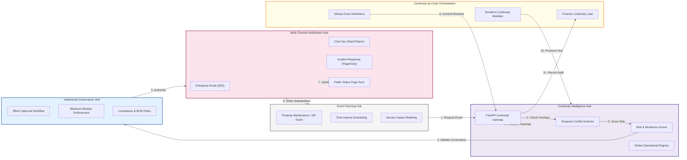

### 2. The Continuity Lifecycle Management Flow
The continuous path for planning and executing high-integrity maintenance and DR events.

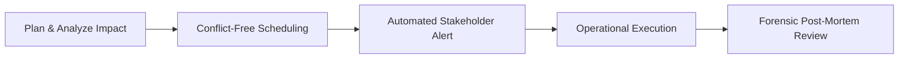

### 3. Conflict Detection Engine Logic
Visualizing the spatial-temporal overlap check used to prevent service contention.

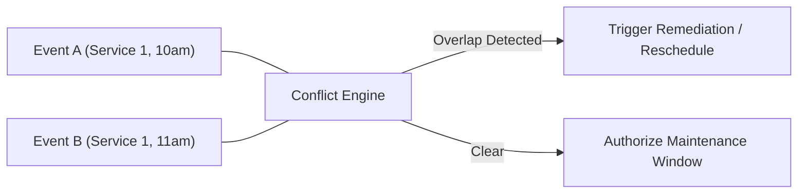

### 4. Multi-Channel Stakeholder Notification Hub
Ensuring that every impacted team is informed through their preferred organizational channel.

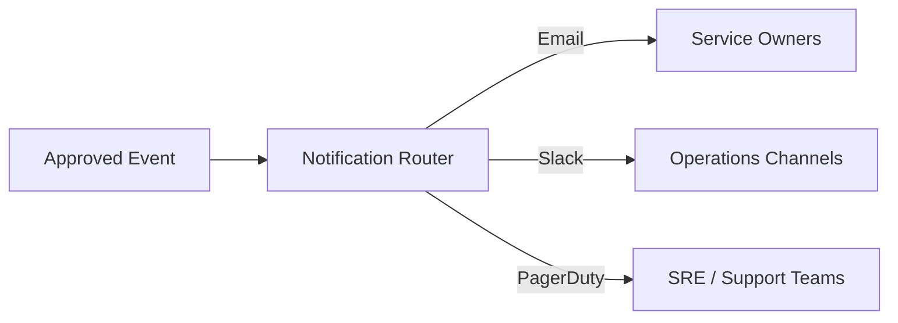

### 5. Service Dependency & Impact Mapping
Linking calendar events to the underlying tiered architecture to predict blast radius.

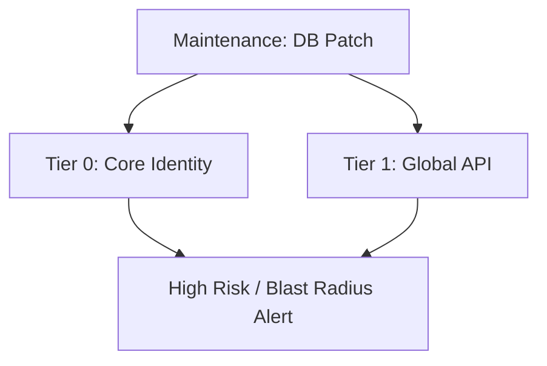

### 6. BCDR Drill & Exercise Orchestration
Using the continuity platform to plan, track, and score institutional resilience exercises.

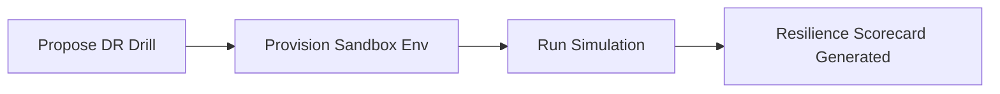

### 7. Maintenance Window Governance (Tiered)
Enforcing organizational windows based on service criticality and business impact.

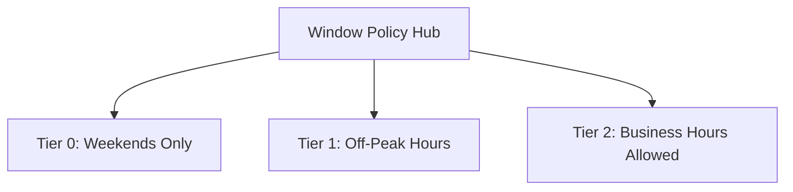

### 8. Identity & RBAC for Continuity Governance
Managing who has the authority to approve high-risk changes and freeze windows.

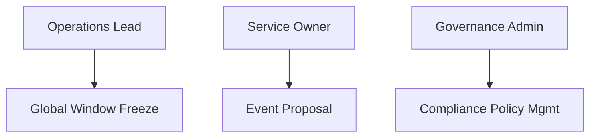

### 9. Real-Time Status Page Integration
Synchronizing the continuity calendar with external communication portals.

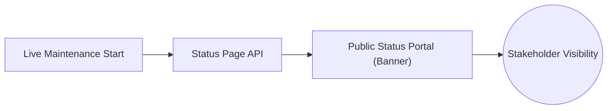

### 10. IaC Deployment: Continuity-as-Code
Using Terraform or YAML to version-control the entire operational schedule.

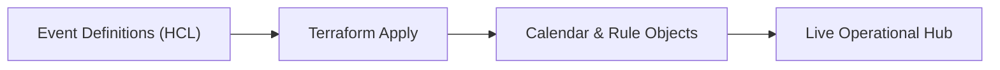

### 11. Metadata Lake for Forensic Continuity Audit
Storing long-term records of every maintenance action for regulatory compliance and trends.

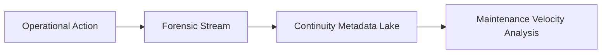

---

## 🏛️ Core Continuity Pillars

1.  **Centralized Operational Registry**: Single source of truth for all global maintenance, patching, DR, and change events.
2.  **High-Fidelity Conflict Detection**: Automated identification of overlapping windows and resource contention across dependencies.
3.  **Advanced Impact Analysis**: Risk-based scoring of operational events to predict downtime probability and service degradation.
4.  **Governance & Approval Engine**: Standardized multi-stage approval workflows that enforce role-based change control.
5.  **Stakeholder Notification Hub**: Automated reminders, escalations, and status updates for impacted teams.
6.  **Immutable Operational Audit**: Comprehensive logging of every scheduling action, approval, and conflict resolution.

---

## 🛠️ Technical Stack & Implementation

### Continuity Engine & APIs
*   **Framework**: Python 3.11+ / FastAPI.
*   **Scheduling Engine**: Time-interval solver with multi-TZ and recurrence support.
*   **Conflict Engine**: Spatial-temporal overlap detector for service-level contention.
*   **Impact Engine**: Risk-based weighting model for service downtime prediction.
*   **State Management**: PostgreSQL (Metadata) and Redis (Event Cache).

### Continuity Dashboard (UI)
*   **Framework**: React 18 / Vite.
*   **Theme**: Emerald / Slate (Modern SRE & Resilience aesthetic).
*   **Visualization**: Recharts for operational heatmaps and impact distributions.

### Infrastructure & DevOps
*   **Runtime**: AWS EKS or Azure Kubernetes Service (AKS).
*   **IaC**: Modular Terraform for deploying the continuity hub and worker distributions.

---

## 🏗️ IaC Mapping (Module Structure)

| Module | Purpose | Real Services |
| :--- | :--- | :--- |
| **`infrastructure/governance`** | Central management plane | EKS, PostgreSQL, Redis |
| **`infrastructure/notifications`** | Multi-channel communication | SES, SNS, Slack API |
| **`infrastructure/storage`** | Operational metadata and audit | RDS, S3 Glacier |
| **`infrastructure/monitoring`** | Status page and health sync | Route53, StatusPage.io API |

---

## 🚀 Deployment Guide

### Local Principal Environment
```bash
# Clone the continuity platform
git clone https://github.com/devopstrio/service-continuity-calendar.git
cd service-continuity-calendar

# Configure environment
cp .env.example .env

# Launch the Continuity stack
make up

# Run a sample scheduling simulation
make schedule-event

# Run service impact analysis
make analyze-impact
```

Access the Service Continuity Dashboard at `http://localhost:3000`.

---

## 📜 License
Distributed under the MIT License. See `LICENSE` for more information.

---
<div align="center">
  <p>© 2026 Devopstrio. All rights reserved.</p>
</div>
